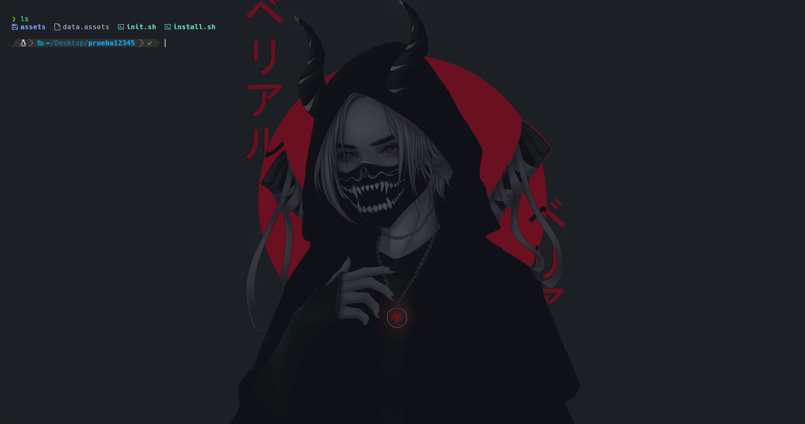
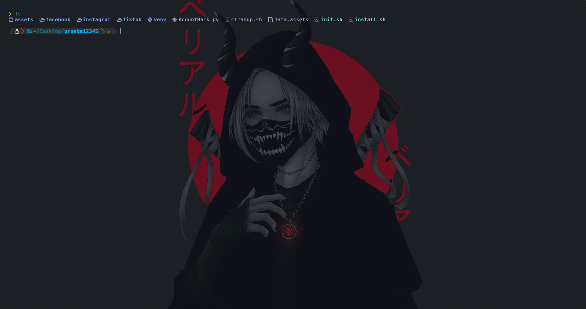

 # The-Hunter


Antes de empezar con la presentación de este framework, cabe recalcar que **esta herramienta está creada con fines educativos y su uso a un tercero sin consentimiento es ilegal, el creador del repositorio no se hace cargo de problemas legales con el uso indebido del framework.**


**The-Hunter** es un framework de simulación de vectores de ataque de ingeniería social. Está creado con el fin de ayudar a los trabajadores de ciberseguridad y los administradores de sistemas a enseñar el funcionamiento de estas webs fraudulentas y entrenar así a los demás en la detección de URLs maliciosas.


# Funcionamiento

Para el uso de esta herramienta, ha de seguir los siguientes pasos:


```bash

# Clonar el repositorio

git clone https://github.com/elpajuelobot/The-Hunter.git


# Entrar al directorio

cd The-Hunter


# Dar permisos y ejecutar el instalador

chmod +x install.sh

sudo ./install.sh

```


### Funcionamiento del `install.sh`:
  * **Desencriptar:** Extrae el contenido de `data.assets` (Contraseña: `password123`).
  * **Preparación:** Configura el entorno virtual y dependencias.
  * **Ejecución:** Lanza automáticamente `init.sh`. Para usos futuros, ejecutar directamente: `sudo ./init.sh`.


Antes de ejecutar el `install.sh`:





Después de ejecutar el `install.sh`:




Una vez el script principal esté funcionando se pedirá que se introduzca una sola vez una clave para el framework de Flask y el enlace de la WEBHOOK de Discord, que se guardaría en un archivo .env. Después se pedirá que elijas la Red social a la que vas a simular y a continuación el enlace al que se va a redirigir una vez los datos sean recogidos.

# Notificaciones

Este framework cuenta con un sistema de notificaciones conectado con discord, usando las urls *Discord Webhooks*, recibirás una alerta en tiempo real cuando se incie un túnel enviándote la url o cuando se capture una interacción del laboratorio.


# Requisitos

*Python 3.10* o superior


*OS basado en linux.* Ej: Ubuntu, Arch, Kali, Parrot, Mint, etc.


*Conexión a internet* para la creación y funcionamiento del túnel. 

*Seguir y ver a S4vitar* **OBLIGATORIO**

# Termux

He sacado una versión de este framework adaptado a su uso en Termux para a los que nos gusta hacer estas cositas por el móvil. [The-Hunter-Termux-Version](https://github.com/elpajuelobot/The-Hunter-Termux-Version.git) tiene exactamente el mismo funcionamiento que el The-Hunter original (Este es el original)
pero completamente adaptado a su funcionamiento en Android con Termux y lo mejor de todo, este framework es Root-less, es decir, que no necesitas tener el móvil rooteado para poder usarlo.
